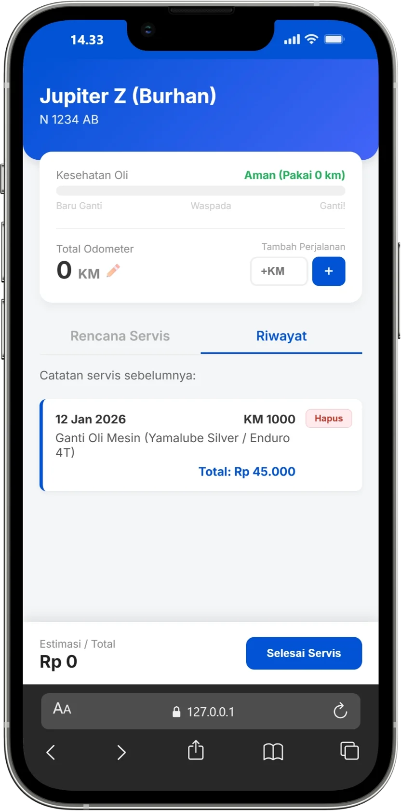
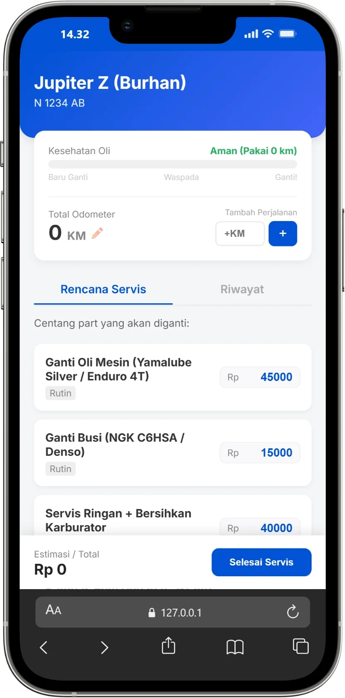

<div align="center">
  
  <h1>MotoMate</h1>
  
  <p>
    <strong>Aplikasi Manajemen Perawatan Motor Pribadi (Jupiter Z Burhan)</strong>
  </p>

  <p>Aplikasi berbasis web (PWA) untuk mencatat riwayat servis, memantau kesehatan oli, dan merencanakan anggaran perawatan motor secara mandiri. Data tersimpan aman di memori HP tanpa perlu koneksi internet.</p>
  
  <p>
    <a href="https://akhmadafnan.github.io/motomate-app/">View Demo</a> •
    <a href="#fitur-unggulan">Fitur</a> •
    <a href="#teknologi">Teknologi</a> •
    <a href="#cara-instalasi">Instalasi</a>
  </p>

  <br>

  <div>
    
    
  </div>

</div>

---

## 📝 Tentang Aplikasi

**MotoMate** adalah aplikasi web berbasis *Progressive Web App* (PWA) yang dirancang untuk membantu pemilik kendaraan memantau kesehatan motornya secara mandiri.

Aplikasi ini dibangun karena permasalahan umum: **lupa kapan terakhir ganti oli** dan **sulit melacak riwayat pengeluaran servis**. Dengan MotoMate, pengguna dapat mencatat odometer, merencanakan anggaran servis, dan mendapatkan visualisasi kesehatan oli secara *real-time* tanpa perlu koneksi internet (setelah diinstal).

Proyek ini dikhususkan untuk spesifikasi **Yamaha Jupiter Z (Burhan)**, namun struktur datanya fleksibel untuk motor jenis lain.

## ✨ Fitur Unggulan

### 1. 🚦 Dashboard Pintar
* **Visualisasi Kesehatan Oli:** Indikator warna (Hijau/Kuning/Merah) yang berubah otomatis berdasarkan selisih KM servis terakhir.
* **Odometer Tracker:** Input penambahan jarak tempuh (Trip) dengan akumulasi otomatis ke total odometer.
* **Edit Mode:** Kemudahan koreksi angka total odometer jika terjadi kesalahan input.

### 2. 📋 Service Planner (Perencanaan)
* **Estimasi Biaya:** Memilih *sparepart* dari katalog untuk melihat estimasi total biaya sebelum ke bengkel.
* **Harga Fleksibel:** Harga part bisa diedit manual (input) sesuai harga realisasi di bengkel (nota asli).

### 3. 📅 Riwayat Servis (Digital Logbook)
* **Pencatatan Detail:** Menyimpan tanggal, KM saat servis, item yang diganti, dan total biaya.
* **Manajemen Data:** Fitur hapus riwayat (delete) untuk menjaga keakuratan data.
* **Data Persistence:** Semua data tersimpan aman di memori perangkat (*LocalStorage*), sehingga data tidak hilang saat browser ditutup.

### 4. 📱 Mobile Experience
* **Installable:** Dapat diinstal ke Home Screen HP Android/iOS layaknya aplikasi native.
* **Fullscreen Mode:** Tampilan aplikasi penuh tanpa *address bar* browser.
* **Offline Ready:** Arsitektur statis yang ringan dan cepat.

## 🛠 Teknologi

Aplikasi ini dibangun dengan pendekatan *Vanilla* (Murni) untuk performa maksimal dan ukuran sekecil mungkin:

* **HTML5 & CSS3:** Desain antarmuka responsif (*Mobile First Approach*).
* **JavaScript (ES6+):** Logika kalkulasi odometer dan manipulasi DOM.
* **LocalStorage API:** Penyimpanan database lokal di sisi klien (*Client-side storage*).
* **JSON:** Manajemen data statis untuk katalog *sparepart* dan profil motor.
* **PWA (Manifest & Service Worker):** Dukungan instalasi aplikasi web.

## 📂 Struktur Proyek

```text
/
├── data/
│   ├── motor.json       # Profil kendaraan (Plat, Model, Tahun)
│   └── parts.json       # Katalog harga & sparepart
├── screenshots/         # Aset gambar dokumentasi aplikasi
├── icon.svg             # Aset Logo Aplikasi
├── index.html           # Halaman Utama (SPA Concept)
├── manifest.json        # Konfigurasi PWA (Nama, Ikon, Warna)
├── README.md            # Dokumentasi Proyek
├── script.js            # Logika Utama (CRUD & Kalkulasi)
└── style.css            # Styling & Responsive Design

<p align="center">
  Dibuat oleh <a href="https://www.instagram.com/afnanf.id" target="_blank">@afnanf.id</a>
</p>